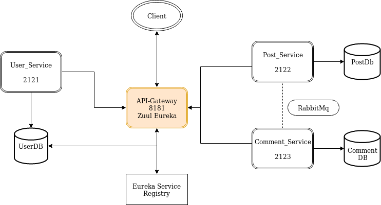
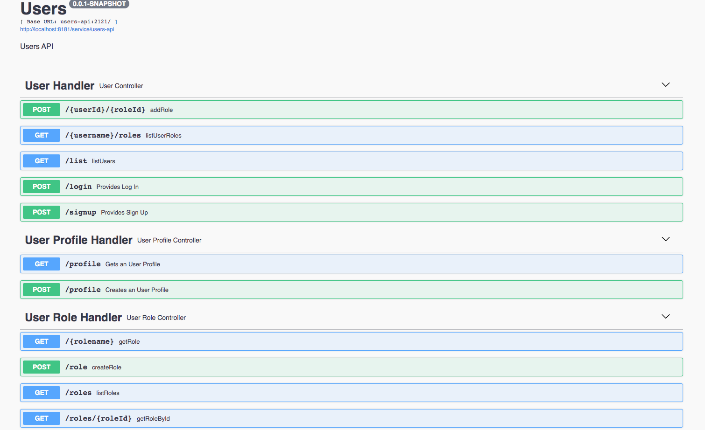
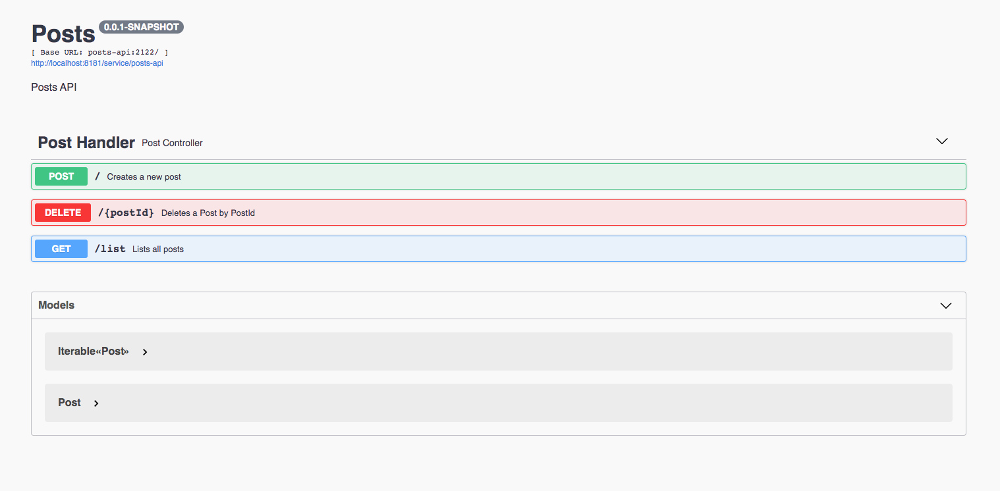
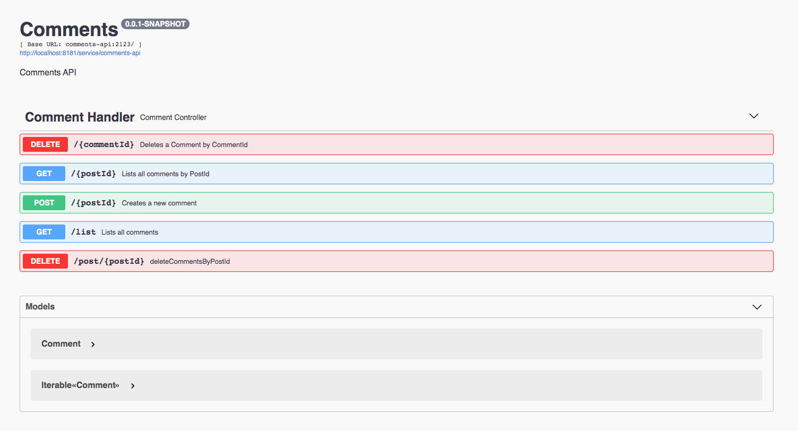
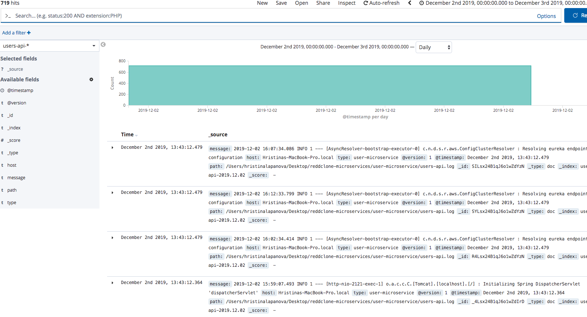
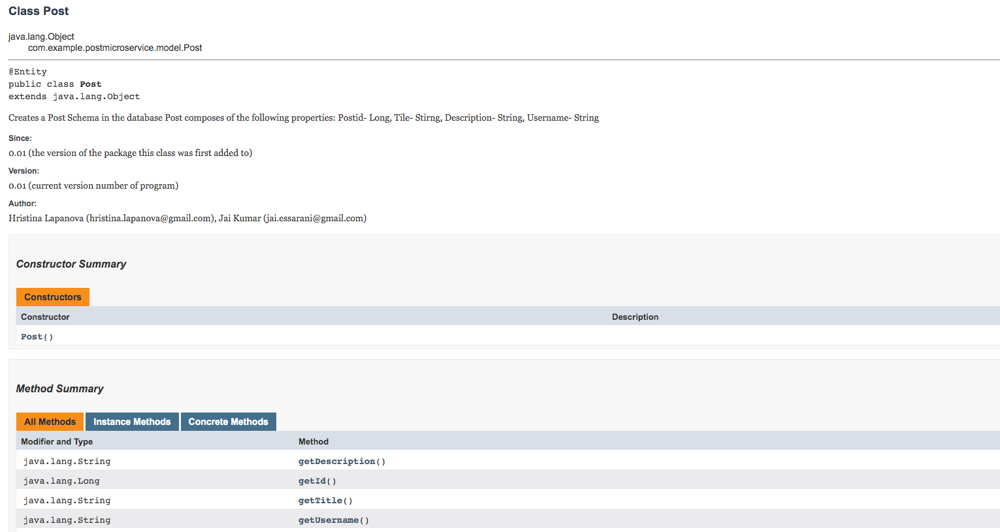
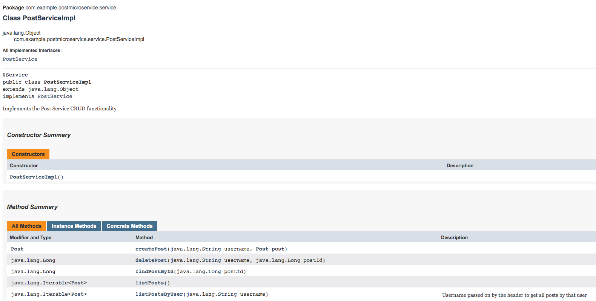

# Reddclone Micro Services

## Table of contents

- [Technologies Used](#technologies-used)

- [Approach & Planning](#approach--planning)

- [User Stories](#)

- [Microservices Architecture](#microservices-architecture)

- [Timeline](#timeline)

## Technologies Used
* User stories [Pivotal Tracker](https://www.pivotaltracker.com/n/projects/2416889)
* Spring Boot
* Zuul Eureka
* Postgres
* Hibernate
* Junit
* Eureka
* Docker
* Hystrix

  Part 2

* RabbitMq
* Swagger to Create API Documentation.
* Jenkins
* Kibana for logging 
* LogStash
* Elastic Search
* Draw.io for Microservices Architecture diagram
* Pivotal Cloud Foundry (hosting)

## Approach & Planning

We started with writing all user stories applicable to the 3 microservices. We devided them into 3 Epics: "User Auth", "Post CRUD" and "Comment CRUD". From there we wrote and evaluated each single story which ties to a feature in each of the services/Epics. Afterwards we started planning and organizing the project. Since we had to have 3 separate services plus the Api-gateway and Eureka we decided on creating 3 databases- UsersDB, PostsDb and CommentsDB, to keep the micorservices as separate as possible so that they execute their own purpose only.

We constructed the skeleton of the project- one main directory with all 5 microservices in it. We configured Eureka first followed by the Api-gateway. Once these were up and running we started building User, Post and Comment microservices. Auth was our next step. We decided to have auth in the Api-gateway which will diretly communicate with the usersDb where the extraction of the username and userId happens.

We built and connected all Apis needed for post and comment CRUD. We used RestTemplate in Post Microservice for it to be able to communicate with Comment Microservice for the two methods where it was needed: Cascade delete all comments that belong to a post,when that post is deleted; Show all comments that belong to a post. Tested all Apis and connected to the front end. 

Part 2

We started with pair programming adding the the implementation of RabbitMq.
The next thing we did was to set up Jenkins pipelines for all services. We added Jenkins files for each micro-service in the root directory of our project. The pipelines successfully executed all stages of each micro-service: Build, Test, Coverage. 
The next thing we did was to add Unit Testing to our micro-services. We then added LogStash, Elastic Search and Kibana for logging.  
## Microservices Architecture

## Challenges

* Making design decisions.

* Creating different databases for each micro-service.

* Security through Api-gateway.

* Intercommunication between services.

* Dealing with Cors errors.

* Deployment and any configurations with it.

* Integration with front-end

    Part 2

* Integrating RabbitMq and testing it

* Building the Jenkins pipelines

* Finding the right Dependencies 

## Wins

* Pair programming.

* Making early design decisions and making them work.

* Figuring out micro-services intercommunication.
  
    Part 2
 
* Pair programming

 

## Timeline

1. Requirement Analysis
    * Sat(Nov 09, 2019) - user stories
        
        Separated the features in user stories so it will give us a clear guideline of what is needed to be done. 
 
            https://www.pivotaltracker.com/n/projects/2416889
    
    * Sunday(Nov 10, 2019) - Project planning
        
            Planned the architecture for the microservices and the databases needed.
                  
    * Monday(Nov 11, 2019) - Project planning
    
            Setted up the skeleton of the project. Created 5 microservices: Eureka, Api-gateway, Users, Posts and Comments.
            
    * Tuesday(Nov 12, 2019) - Security functionality added.
    
             Added security functionality in Api-gateway and authentication in User-service.
        
    * Wednesday(Nov 13, 2019) - Worked on routes for Post and Comment CRUD.
           
    * Thursday(Nov 14, 2019) - Worked on routes for Post and Comment CRUD..
         
    * Friday(Nov 15, 2019) - Worked on deployment. Eureka and Api-gateway have been deployed.

    * Saturday(Nov 16, 2019) - Worked on restTemplate for post and comment to connect.

    * Sunday(Nov 17, 2019) - Connected to the front-end.
    
    * Thursday / Friday (Nov 21/22, 2019)- Setting up RabbitMq and inter-service communication.
    
    * Saturday & Sunday (Nov 23/24, 2019)- Finish the inter-service communication and complete Swagger.
    
    * Monday (Nov 25, 2019)- Finish Swagger, start Error Handling 
    
    * Tuesday (Nov 26. 2019)- Start Jenkins
    
    * Wednesday (Nov 27, 2019)- Finish Jenkins
    
    * Thursday- Sunday (Nov 28 to Dec 1, 2019) Start testing.
    
    * Monday/ Tuesday (Dec 2- Dec 3, 2019) - Logging and Monitoring 
    
    * Wednesday (Dec 3, 2019) - Presentations
    
            *-*-*-*-*-*-*
            
## Swagger 

    We added Swagger to each Microservice to document the APIs used in them. For a setup 
    there is a SwaggerDocConfig file in each microservice. In the Controller we added 
    @ApiOperation for each method to describe their functionality and what it produces. 
    We used @ApiParam to describe what parameters it requires.

           

## ELK stack

    We started with starting the services in the terminal as follows:
    
    brew services start logstash
    brew services start elasticsearch
    brew services start kibana
    
    The name of the logging file was added to the application.properties file. We initiated a 
    logger in the ServiceImpl classes and logged.info(msg) or logger.warn(msg) for each method.

    

## JavaDocs

    We started with running mvn javadoc:javadoc in the terminal. Then opened the index.html in the target 
    folder.For a set up we added the information about the contributors to the project as well as its current 
    version on top of the Model in each microservice. We continued with adding more comments in the rest of 
    the classes with descriptions of their functionality and what parameters they take and what results they 
    return using annotations such as @param, @return).

## Backlog

* Delete everything when user is deleted
* Finish up deployment 
* Utilize RabbitMQ for interservice communication, rather than RestTemplate 
* Refactor code
* Comment on code
* Test code 

