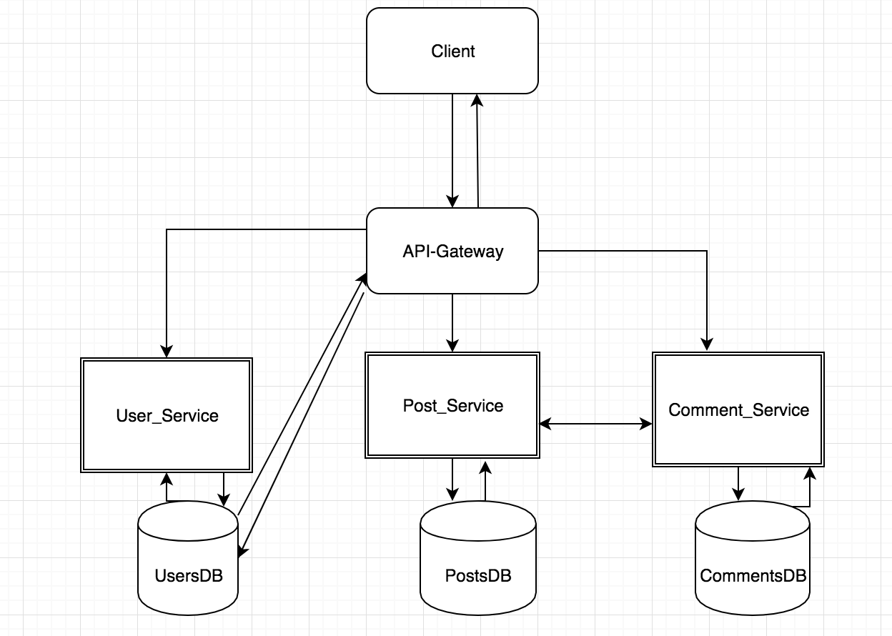

# Reddclone Micro Services

## Table of contents

- [Technologies Used](#technologies-used)

- [Approach & Planning](#approach--planning)

- [User Stories](#)

- [Microservices Architecture](#microservices-architecture)

- [Timeline](#timeline)

## Technologies Used
* User stories [Pivotal Tracker](https://www.pivotaltracker.com/n/projects/2416889)
* Spring
* Hibernate
* Junit
* Eureka
* Docker
* Hystrix

* RestTemplate
* Draw.io for Microservices Architecture diagram
* Pivotal Cloud Foundry (hosting)

## Approach & Planning

We started with writing all user stories applicable to the 3 microservices. We devided them into 3 Epics: "User Auth", "Post CRUD" and "Comment CRUD". From there we wrote and evaluated each single story which ties to a feature in each of the services/Epics. Afterwards we started planning and organizing the project. Since we had to have 3 separate services plus the Api-gateway and Eureka we decided on creating 3 databases- UsersDB, PostsDb and CommentsDB, to keep the micorservices as separate as possible so that they execute their own purpose only.

We constructed the skeleton of the project- one main directory with all 5 microservices in it. We configured Eureka first followed by the Api-gateway. Once these were up and running we started building User, Post and Comment microservices. Auth was our next step. We decided to have auth in the Api-gateway which will diretly communicate with the usersDb where the extraction of the username and userId happens.

We built and connected all Apis needed for post and comment CRUD. We used RestTemplate in Post Microservice for it to be able to communicate with Comment Microservice for the two methods where it was needed: Cascade delete all comments that belong to a post,when that post is deleted; Show all comments that belong to a post. Tested all Apis and connected to the front end. 

## Microservices Architecture

## Challenges

* Making design decisions.

* Creating different databases for each microservice.

* Security throught Api-gateway.

* Intercommunication between services.

* Deployment and any configurations with it.

## Wins

* Pair programming.

* Making early design desicions and making them work.

* Figuring out microservices intercommunication.
 

## Timeline

1. Requirement Analysis
    * Sat(Nov 09, 2019) - user stories
        
        Separated the features in user stories so it will give us a clear guideline of what is needed to be done. 
 
            https://www.pivotaltracker.com/n/projects/2416889
    
    * Sunday(Nov 10, 2019) - Project planning
        
            Planned the architecture for the microservices and the databases needed.
                  
    * Monday(Nov 11, 2019) - Project planning
    
            Setted up the skeleton of the project. Created 5 microservices: Eureka, Api-gateway, Users, Posts and Comments.
            
    * Tuesday(Nov 12, 2019) - Security functionality added.
    
             Added security functionality in Api-gateway and authentication in User-service.
        
    * Wednesday(Nov 13, 2019) - Worked on routes for Post and Comment CRUD.
           
    * Thursday(Nov 14, 2019) - Worked on routes for Post and Comment CRUD..
         
    * Friday(Nov 15, 2019) - Worked on deployment. Eureka and Api-gateway have been deployed.

    * Saturday(Nov 16, 2019) - Worked on restTemplate for post and comment to connect.

    * Sunday(Nov 17, 2019) - Connected to the front-end.
    
            *-*-*-*-*-*-*
